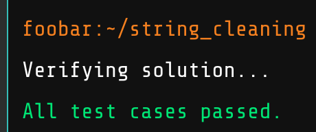

### FooBar Challenges
<i>courtesy of Google</i>
<!--
Google proves once again that the search engine has the power to excite and shows that searching the web  -->

A few weeks ago, I heard about a friend searching google for programming related terms and having a div pop up inviting them to take challenge. Not knowing python or java, the friend did not do the challenges. I, on the other hand, started learning python in October, and decided I was going to hit google so many times I got the div to pop up on my own computer.

#### My steps in the process:

1) Search google a couple times for others who have also gotten the challenges

    - Decided my search terms of choice would be "Python Command Line Arguments"

2) Start writing a script to refresh google several times until the div popped up

    - Quickly discovered that Google does not have standard jquery on their page

3) Loaded Jquery on Google, and used $("div").show()

    - turns out google hides a bunch of divs.

    - but the div that lets you take the challenges is not a hidden one

4) Search the terms about 25 times.

    

    - and voila! I finally hit it.

The algorithms are fun and challenging. I didn't start saving the readmes until later, but I have most of them.

Puzzles are great!
